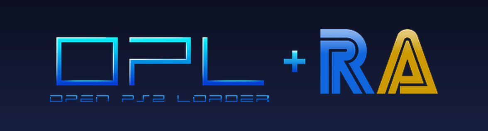
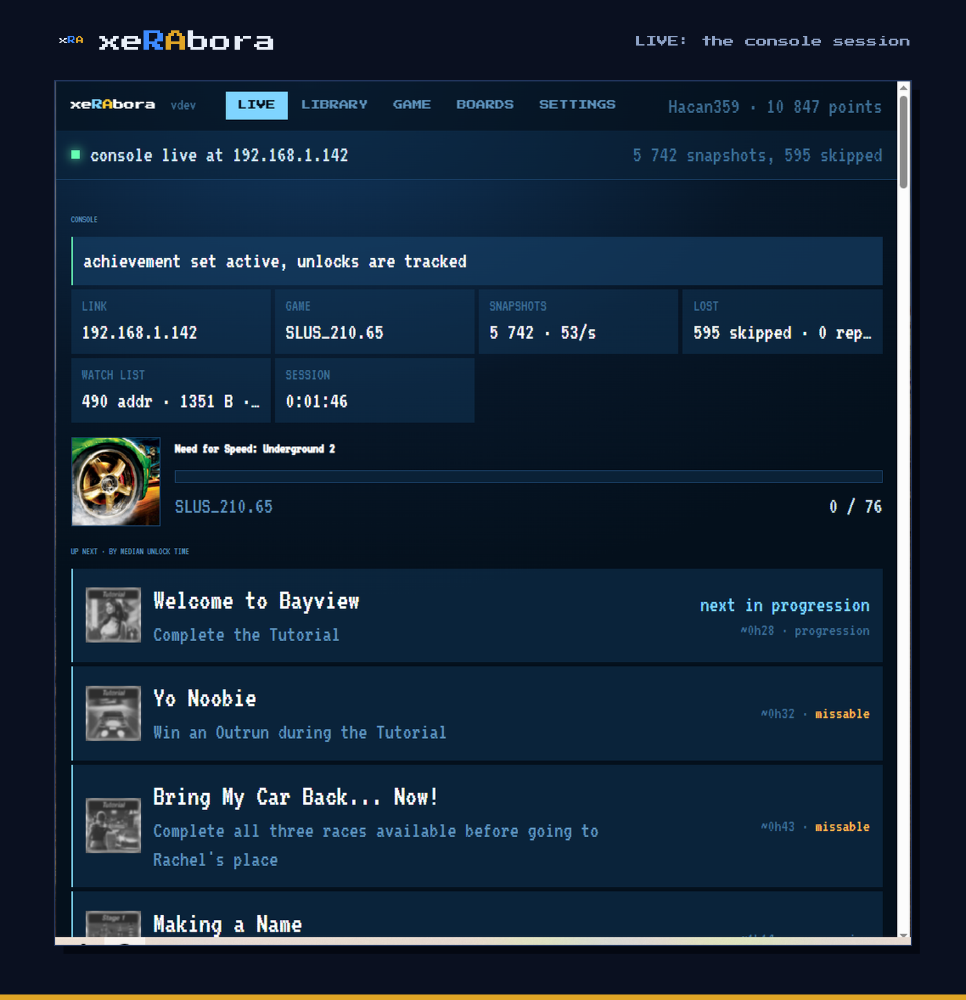
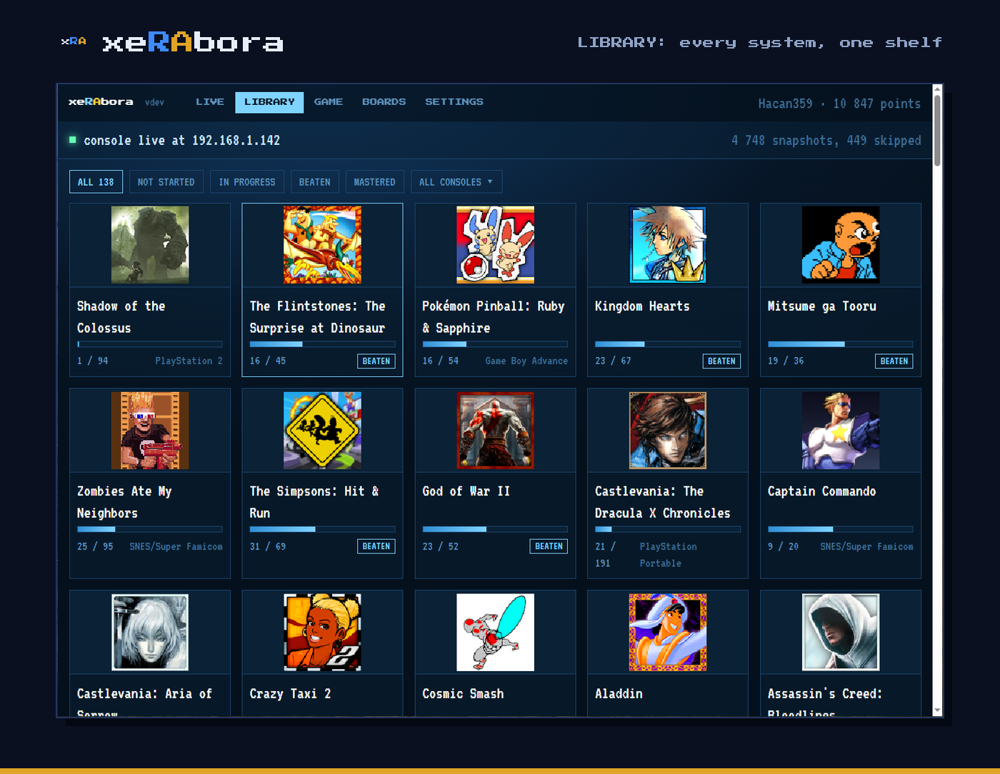

<p align="center">
  
</p>

# xeRAbora

A RetroAchievements companion for people who play on real hardware: your
library, what to chase next, the missables you are about to lose, the
leaderboards and your rank in one window, and a live view of the console.

**Project page:** [hacan359.github.io/xerabora](https://hacan359.github.io/xerabora/) —
the setup as a walkthrough: [How to start](https://hacan359.github.io/xerabora/#start).

xeRAbora shows your RetroAchievements life in one window: the library
across every system, each game's achievements in the author's order or
the order players earn them in practice, leaderboards, your profile. Plug in
a console that streams its memory and the same window comes alive:
measured progress, live leaderboard trackers, an unlock the moment it
happens, and a flash on the TV. The console speaks a small, open UDP
protocol; the first console that does is the PlayStation 2, through a
fork of Open PS2 Loader that ships with this project. No emulator is
involved.

> [!WARNING]
> **Experimental.** A hobby project in alpha. The PS2 side is tested with
> games on a USB stick and from the original disc, on two consoles. Use
> it at your own risk.

<p align="center">
  
</p>

## What it does

- **Library.** Every game you have touched on RetroAchievements, with
  progress, awards and filters by status and console.
- **Game.** One set in full: the author's order, the intended path
  (progression, win condition, missables flagged) and the median time
  players take to unlock each achievement.
- **Boards.** A game's leaderboards with the top entries.
- **Live.** With a console connected: the running game as the console
  sees it, measured progress (3 of 10), UP NEXT by median unlock time,
  live leaderboard trackers straight from console memory, and a CONSOLE
  panel with the link, the snapshot rate and the losses.
- **Unlocks** land on your profile the moment they happen, with a toast
  on the page, a sound on the PC and a gold flash on the console.
- **Stream-ready.** The interface is a page the client serves to itself
  on `localhost`, so OBS takes it as a browser source; `--obs DIR`
  writes labels and `data.json` as well.
- **On a phone.** One switch in SETTINGS opens the same page to your
  Wi-Fi: a phone or tablet shows the tracker while you play, and the
  PC keeps the controls.
- **One file.** A single executable for Windows or Linux, nothing to
  install. Login is optional: the library and the boards work on a Web
  API key alone; unlocking needs the account.

<p align="center">
  
</p>

## Any hardware, one protocol

The client knows nothing about the PS2. It identifies a game by the hash
an agent sends, asks the RetroAchievements server for the set, derives
the list of memory addresses the set reads, and hands that *watch list*
to the agent. From then on the agent streams those addresses every frame
and the client runs [rcheevos](https://github.com/RetroAchievements/rcheevos),
the same engine the emulators use. Unlock notices go the other way.

The whole exchange is a handful of UDP messages, documented in
[`protocol/PROTOCOL.md`](protocol/PROTOCOL.md). An agent for another
console needs to read that console's memory, compute the RetroAchievements
hash, and speak the protocol. The client does the rest.

## PlayStation 2: the first agent

The PS2 agent is a fork of [Open PS2 Loader](https://github.com/ps2homebrew/Open-PS2-Loader).
It reads the running game's memory every frame and streams it over the
network, hashes the image so the game is identified before you play, and
shows a gold flash over the game when an achievement unlocks. It needs
nothing beyond what OPL already needs and changes nothing in the game.

### What you need

- A PS2 with a network adapter and a way to run OPL (FMCB, FHDB or similar).
- Your game images on a USB stick, or the original disc in the drive. Both
  are tested; a share is optional and the internal HDD is untested.
- A PC on the same local network, Windows or Linux.
- A [RetroAchievements](https://retroachievements.org) account.

### Setup

1. Download `OPL-RA.ELF` and `xerabora.exe` (Windows) or `xerabora-linux-x86_64`
   (Linux) from the [releases](../../releases).
2. Put `OPL-RA.ELF` where you keep your OPL and launch it instead of OPL.
   It behaves like OPL 1.2.0 with two extra items in each game's menu.
3. The RA menu items report their result as an on-screen notice whatever
   OPL's **Notifications** setting says. Turn that setting on if you also
   want OPL's own notices.
4. Run `xerabora` on the PC. It opens its page in your browser. On the
   **SETTINGS** tab sign in with your RetroAchievements login (needed for
   unlocks) and paste the Web API key from your RA profile settings (it
   fills the library, leaderboards and profile). The login token and the
   key are kept in your user profile (`%LOCALAPPDATA%\xerabora` on Windows,
   `~/.config/xerabora` on Linux); the password is not stored.
5. On the console, select a game, open its menu (triangle) and choose
   **RA: test PC connection**. A notice tells you whether `xerabora` answered,
   from which address and how fast. If nothing answers, check that the PC
   is on the same network and that the firewall allows inbound UDP 18194.
6. In the same menu choose **RA: check game support**. The console hashes
   the disc image and asks the PC whether RetroAchievements knows it; the
   notice shows the game title and the achievement counts (total, unlocked,
   unsupported). Supported games get an `RA` prefix in the list and a badge
   on the cover art.
7. Start the game. Within about 30 seconds the **LIVE** tab shows the
   console connected, the set and the first snapshot. An unlock shows on
   the page, on your profile, and as a short gold flash over the game on
   the console.

**Playing from the original disc.** Put the disc in the drive, press START
for OPL's main menu and choose **RA: check disc support**, then **RA: launch
disc**. The check reads the disc through the console's own driver and asks
the PC the same way it does for an image; the launch boots the disc under
OPL's in-game hooks, so telemetry and unlocks work exactly as from USB.
In this mode OPL's virtual memory cards, per-game compatibility patches
and cheats are not available -- they live inside the part of OPL that
emulates the drive, which a real disc does not use.

Disc mode is experimental. It has been verified with Shadow of the
Colossus only; a game it cannot boot may hang the console hard (black
screen, the reset button does nothing) -- power the console off and back on
to recover. Transformers: The Game is one known case.

The full walkthrough is in [docs/USAGE.md](docs/USAGE.md); the same
steps are on the [project page](https://hacan359.github.io/xerabora/#start).

## Where this is going

- **Pointer chains on the console.** The agent reads flat addresses
  today. Next it reads the pointer bases too and the client asks for the
  targets on the following frame, so sets that dereference pointers
  unlock on real hardware as well.
- **Guidance wherever you play.** UP NEXT, missable warnings and the
  progression order come from RetroAchievements data, so they work for
  any game you have started, on the console, on a PC or in an emulator.
  The goal is a companion that walks you through a set so you miss
  nothing on the way to mastery.
- **More agents, one protocol.** An agent for another console, or for an
  emulator that wants the same window, speaks the protocol and the
  client does the rest.
- **Louder unlocks.** Controller rumble in step with the flash, a badge
  on the TV, a mastery alert on the page, Discord presence.
- **For streams.** A compact overlay layout for OBS, live counters from
  the game's own values, leaderboard trackers beside the video.
- **Hardcore.** RetroAchievements decides who qualifies; the question is
  with the RA team.

## The PC client, in detail

The interface is a page the client serves to itself on `localhost`,
compiled into the executable. On Windows a double click opens the page
and no console window; `--console` opens one, and everything is also
written to `xerabora.log` next to the saved login. One copy runs at a
time: a second double click opens the running copy's page.

Softcore only. The console can write to game memory (OPL's cheat engine),
so `xerabora` does not claim hardcore mode. Leaderboard trackers run and
show on BOARDS, but RetroAchievements takes entries from hardcore only,
so none are posted.

`xerabora` plays a short sound when the console connects, when the stream
stops for five seconds, and when an achievement unlocks. `--no-sound`
turns them off. To use your own, put `connect.wav`, `disconnect.wav` or
`achievement.wav` into the `sounds` folder next to the saved login
(`%LOCALAPPDATA%\xerabora\sounds` or `~/.config/xerabora\sounds`). On Linux the
sounds go through `paplay`, `aplay` or `pw-play`, whichever is installed.

## How the PS2 side works

```
PS2 game ──► ee_core reads watched addresses every frame (VBLANK)
         ──► SIF DMA ──► raudp (IOP) builds UDP frames, bypasses the TCP/IP stack
         ──► Ethernet ──► xerabora on the PC ──► rcheevos ──► retroachievements.org
                      ◄── RAU1 unlock notice ◄──
```

- **Image check** (OPL menu): the console computes the RetroAchievements
  hash of the disc image and broadcasts `RAQ1 <hash>`. `xerabora` asks the RA
  server for the achievement set, extracts every memory address the set
  reads, and sends that *watch list* back in chunks. The console stores it
  next to the game and in memory.
- **In game**: `ee_core` copies the watched values into a snapshot every
  frame and DMAs it to the IOP. `raudp` finds the PC with one broadcast,
  then sends each snapshot as one or two 1472-byte UDP packets, built by
  hand and handed straight to the network driver so the game's own traffic
  is never blocked.
- **On the PC**: `xerabora` reassembles snapshots, exposes them to rcheevos as
  a sparse memory space, and rc_client evaluates the achievements.
- **Unlock notice**: the client sends `RAU1` back to the console. `raudp`
  reads it straight off the network hardware (the TCP/IP stack is idle
  inside a running game), DMAs it to `ee_core`, and the VBLANK handler
  plays a gold flash by writing two GS registers. No VRAM, no game DMA.

The console side does not follow pointer chains (indirect reads). An
achievement that reads through one stays active but cannot unlock here,
because such a read returns 0; `xerabora` reports how many. Arithmetic
over plain addresses (AddSource chains and the like) is fine. Most PS2
sets lose few or none: Shadow of the Colossus none of 96, Transformers:
The Game 5 of 76.

Known limits:

- The PC must be on the same subnet as the console. The console learns the
  PC's MAC address from the discovery reply; a PC behind a router is heard
  but cannot be answered.
- The image check reads plain ISO images whose boot executable sits in the
  root directory (all retail PS2 discs do), named either `Title.iso` or the
  OPL Manager way, `SLUS_123.45.Title.iso`. ZSO and UL-format images are
  not hashed.
- A disc the drive cannot read all the way through -- one the console will
  not boot from its own browser either -- fails the check with "could not
  read SYSTEM.CNF"; that is the disc or the laser, not the software.
- Telemetry starts when the game opens its controller through libpad, which
  is how OPL's in-game hooks attach. A game with unusual input code may
  never start sending; the PC then shows no snapshots.
- Reads see RAM, not the EE data cache, so a value the game wrote very
  recently can lag by a fraction of a frame.

## Building

**OPL fork** needs the ps2dev toolchain. The simplest route is the same
container the OPL project uses:

```
docker run --rm -v "$PWD":/src -w /src/opl ghcr.io/ps2homebrew/ps2homebrew:main make PADEMU=0 all
```

`make RA_DEBUG=1 all` builds the debug variant: it writes the loader's
module results to `RA/launch.txt` on the share. Inside the game it does
nothing extra.

**PC client** (`client/`) builds on its own, without the OPL fork: it
needs only rcheevos and the headers in `protocol/`. `make` on Linux needs
gcc and libcurl development headers. `make windows` cross-compiles a
static `xerabora.exe` with MinGW-w64 (`gcc-mingw-w64-x86-64` on
Debian/Ubuntu); HTTPS goes through WinHTTP, so the Windows build has no
external dependencies. The page lives in `client/ui/index.html`; after
editing it, `python3 tools/embed-page.py` puts it back into the binary,
and `--ui-file client/ui/index.html` serves it from disk meanwhile.

Both the OPL fork and rcheevos are git submodules. Clone with
`--recurse-submodules`, or run `git submodule update --init --recursive`
after cloning. Building the client needs only `third_party/rcheevos`; the
`opl` submodule is there to build the console loader.

## Repository layout

| path | contents |
|---|---|
| `client/` | the PC client: the RetroAchievements client, its page (`ui/`), the protocol side |
| `protocol/` | the wire protocol &mdash; [`PROTOCOL.md`](protocol/PROTOCOL.md) plus the shared `ra_snap.h` / `ra_watch.h` |
| `opl/` | submodule &rarr; the [OPL+RA fork](https://github.com/hacan359/Open-PS2-Loader/tree/ra), the PS2 agent. RA additions: `src/ra*.c`, `ee_core/src/ra.c`, `ee_core/src/ra_overlay.c`, `modules/network/raudp`, `modules/network/ps2ips-ra`, small changes in `SMSTCPIP` and `smap-ingame` |
| `third_party/rcheevos` | submodule, rcheevos, unmodified |
| `docs/` | the project page, the usage guide, screenshots |
| `tools/` | development helpers |

## Notes for OPL developers

- `modules/network/ps2ips-ra` is ps2sdk's `ps2ips.irx` with two fixes.
  In `do_recvfrom` the shared RPC buffer was overwritten before the DMA
  destination was read, so UDP receive on the EE never worked. In both
  `do_recv` and `do_recvfrom` the 144-byte `rests_pkt` was DMA'd into
  the EE's 128-byte `_intr_data`, zeroing the socket `close` pointer in
  `libps2ips` right behind it; every socket then leaked and the menu had
  one network operation per boot. The transfer is now capped at 128
  bytes. EE code receiving through `ps2ips` should still use 64-byte
  aligned buffers and lengths that are multiples of 64 (see `src/ranet.c`).
  Both candidates for upstreaming to ps2sdk.
- Non-blocking receive on the menu (netman) lwIP stack: setting the
  socket non-blocking with `fcntl(O_NONBLOCK)` did not take effect on
  hardware; `recvfrom` blocked the EE I/O thread forever when no reply
  came. `src/ranet.c` therefore passes `MSG_DONTWAIT` (value `0x08`, the
  lwIP/IOP value — not the EE `<sys/socket.h>` `0x80`, since the flag is
  forwarded verbatim over RPC to `lwip_recvfrom` on the IOP) on every
  receive, which lwIP honours per call.
- Inside a running game lwIP is idle in both directions: the SMAP receive
  FIFO fills and nobody drains it, and `lwip_sendto()` puts nothing on
  the wire. `raudp` therefore walks the receive descriptors itself and
  sends its replies down the same raw path as the telemetry.
- `modules/network/common/smstcpip.h` declared `lwip_recvfrom` with six
  arguments; the SMSTCPIP implementation takes eight. Fixed here.
- The fork loads the network modules in every game mode, including USB,
  and builds `cdvdman` with `USE_DEV9=1` for the BDM variant.

## License

The OPL fork keeps OPL's license (Academic Free License 3.0). The PC
client is released under the MIT license. rcheevos is MIT.

The RA mark belongs to RetroAchievements and the OPL name to the Open
PS2 Loader project; they appear here to show what this project connects.
